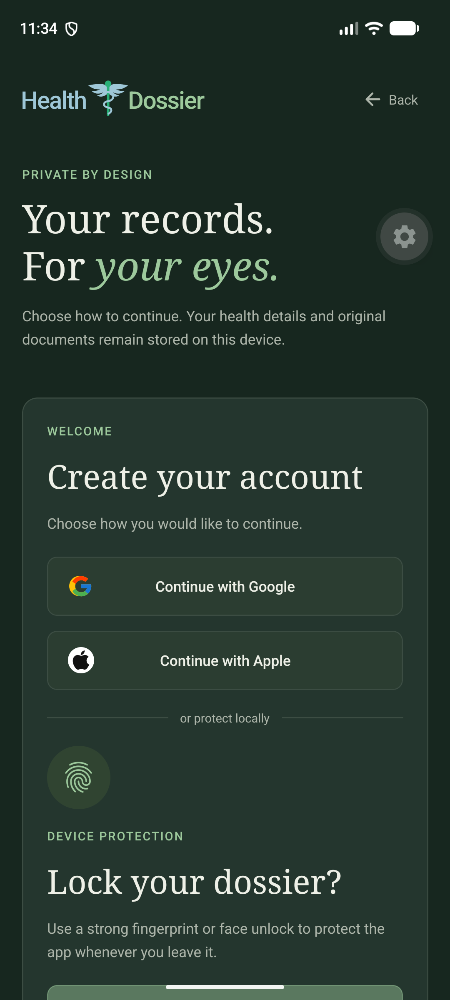

<div align="center">
  <h1>Health Dossier for Android</h1>
  <p><strong>A private home for your health story.</strong></p>
  <p>Keep medical records organized, find the document you need, and carry the essentials with you—even offline.</p>
  <p>Expo 57 · React Native · TypeScript · Expo Router · SQLite</p>
</div>

<p align="center">
  
  &nbsp;&nbsp;
  
</p>

## Your health records, without the clutter

Health Dossier is a mobile-first medical record organizer for Android. Add reports, prescriptions, scans, and care notes; browse them as a searchable library or chronological timeline; and group related documents into Care Collections.

Everything is designed to remain useful without a network connection.

## What you can do

- Add PDF, JPG, PNG, or WebP records up to 25 MB each.
- Save a title, date, record type, provider, notes, and an important marker alongside the original file.
- Search and filter the record library or browse a year-by-year health timeline.
- Preview, open, share, edit, and delete stored documents.
- Maintain a health summary with medications, allergies, ongoing conditions, blood type, emergency contact, and care notes.
- Group related records into Care Collections with private notes and their own timelines.
- Protect the app with a strong fingerprint or face unlock.
- Choose whether the app locks immediately, after one minute, or after five minutes.
- Use the complete record library offline.

## Privacy by design

Record metadata and health details are stored in `expo-sqlite`. Imported originals are copied into the app's private document directory. Nothing is uploaded by the current application.

The Google and Apple signup buttons are front-end flows only; they do not create an online account. App lock protects access through the application interface, but the SQLite database and imported files are not separately encrypted at rest.

Removing a collection preserves its records. Removing a record also removes its saved original. Uninstalling the app may remove all locally stored dossier data, so important documents should also be kept somewhere safe.

## Run on an Android emulator

Install the dependencies:

```bash
npm ci
```

Start an emulator from **Android Studio → Device Manager**, then launch the Expo development server:

```bash
npx expo start --android
```

You can also run `npx expo start` and press <kbd>a</kbd> after the server starts.

> [!IMPORTANT]
> This repository uses Expo Continuous Native Generation and does not keep a generated Gradle project in source control. Open Android Studio to manage the emulator, but start the application from the project terminal with Expo. Do not wait for Android Studio's Gradle Run button when opening this folder directly.

If Expo cannot find `adb` on macOS, add the Android SDK tools to your shell path:

```bash
export PATH="$PATH:$HOME/Library/Android/sdk/platform-tools:$HOME/Library/Android/sdk/emulator"
npx expo start --android
```

## Quality checks

```bash
npm run typecheck
npm run lint
npm test
npx expo-doctor
npm run bundle:android
```

## Project structure

```text
src/
├── app/            Expo Router screens and layouts
├── components/     Shared UI and app-lock provider
├── constants/      Theme tokens
├── lib/            Database, files, and secure preferences
├── types/          Domain models and formatting helpers
└── __tests__/      Unit tests
```

## Built with

- [Expo](https://expo.dev/) and [React Native](https://reactnative.dev/)
- [Expo Router](https://docs.expo.dev/router/introduction/) for file-based navigation
- [Expo SQLite](https://docs.expo.dev/versions/v57.0.0/sdk/sqlite/) for local structured data
- [Expo FileSystem](https://docs.expo.dev/versions/v57.0.0/sdk/filesystem/) for imported originals
- [Expo LocalAuthentication](https://docs.expo.dev/versions/v57.0.0/sdk/local-authentication/) and SecureStore for app-lock preferences
- TypeScript and Jest
